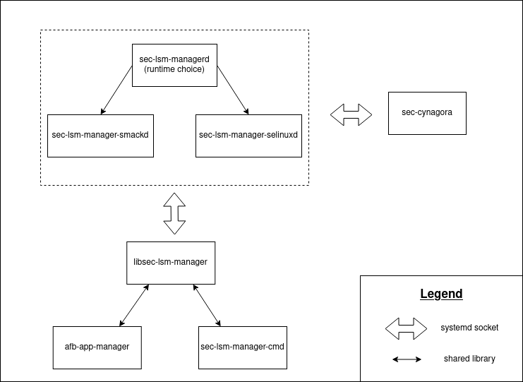

# SEC-LSM-MANAGER


## Overview

sec-lsm-manager allows to easily create SMACK or SELinux security policies for applications.
It is used in the [redpesk](https://docs.redpesk.bzh/) project to guarantee the partitioning of applications within a Linux embedded system.

## History

The sec-lsm-manager project is a redesign of the [security-manager](https://github.com/Samsung/security-manager) project presented in [Tizen](https://www.tizen.org/) and [Automotive Grade Linux](https://www.automotivelinux.org/) systems. The code is lighter, more easily auditable and allows to use SELinux.

## Usage

The project produces binaries :

- `sec-lsm-managerd` (lauch smack or selinux daemon)
- `sec-lsm-manager-smackd` (lauch smack daemon)
- `sec-lsm-manager-selinuxd` (lauch selinux daemon)
- `sec-lsm-manager-cmd` (Allows the client to communicate with the daemon in command line)

And a shared library :

- `libsec-lsm-manager.so`

It is possible to access this library through the `sec-lsm-manager.h` file and the associated pkgconfig.

For more information about usage : [Usage.md](./docs/Usage.md)

## How to compile?

To compile the project we use make and cmake.

The project has some dependencies:

- libcap (capabilities management)

- libsystemd (systemd socket activation)

- libsmack (SMACK mode)

- libselinux (SELinux mode)

- libsemanage (SELinux mode)

- sec-cynagora (permission database service)

By default the project is compiled with all these dependencies but only `libcap` is mandatory.

Here is an example to compile the project for SMACK and SELinux :

```bash
git clone https://github.com/redpesk-core/sec-lsm-manager
cd sec-lsm-manager
mkdir build
cd build
cmake -DWITH_SELINUX=ON -DWITH_SMACK=ON ..
make
```

For more information about compilation : [Compilation.md](./docs/Compilation.md)

## Architecture



For more information about architecture : [Architecture.md](./docs/Architecture.md)
